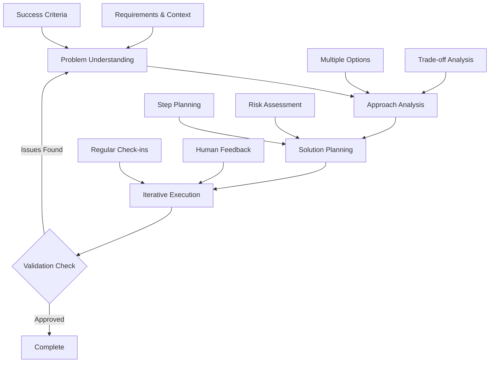

# Human-AI Collaboration Framework

## Vision

This framework establishes a systematic approach to human-AI collaboration that prioritizes thoughtful problem-solving partnerships over simple solution generation. By implementing structured reasoning chains, clear communication patterns, and quality assurance mechanisms, it enables productive collaboration that leverages both human insight and AI capabilities.

## Core Philosophy

### Collaborative Problem-Solving
- **Human-in-the-loop**: AI operates as a thoughtful partner, not an autonomous solution generator
- **Chain-of-thought reasoning**: All complex problems are broken down into clear, reviewable steps
- **Iterative refinement**: Solutions evolve through feedback cycles and validation checkpoints
- **Context preservation**: Decisions, rationale, and learning are systematically captured

### Quality Through Process
- **Transparency**: AI shows its thinking process and confidence levels
- **Validation**: Multiple checkpoints ensure alignment and quality
- **Adaptability**: Framework adapts to different problem domains and complexity levels
- **Learning**: Both human and AI improve through documented iterations

## Architectural Principles

### 1. Structured Reasoning Chain

The framework implements a four-stage reasoning process:



#### Stage 1: Problem Understanding
- **Purpose**: Establish clear, shared understanding of the task
- **Key Questions**:
  - What exactly needs to be addressed/analyzed/solved?
  - What are the key requirements and constraints?
  - How does this fit with broader context or goals?
  - What success criteria should we aim for?
- **Output**: Validated problem definition and success criteria

#### Stage 2: Approach Analysis
- **Purpose**: Evaluate multiple solution approaches transparently
- **Process**: Present 2-3 viable options with pros/cons analysis
- **Decision**: Human selects preferred approach or requests modifications
- **Output**: Approved solution strategy with rationale

#### Stage 3: Solution Planning
- **Purpose**: Create detailed, reviewable implementation plan
- **Components**:
  - Ordered key steps
  - Required resources and dependencies
  - Potential challenges and mitigation strategies
  - Validation checkpoints
- **Output**: Approved implementation roadmap

#### Stage 4: Iterative Execution
- **Purpose**: Implement solution with continuous validation
- **Pattern**: Execute step → Present results → Gather feedback → Adjust
- **Quality Gates**: Regular human review and approval
- **Output**: Validated solution components

### 2. Adaptive Communication Patterns

The framework provides standardized communication templates that trigger based on context:

#### Confidence-Based Triggers
- **High Confidence (>70%)**: Direct presentation with reasoning
- **Medium Confidence (40-70%)**: Present options with uncertainty areas
- **Low Confidence (<40%)**: Explicit uncertainty acknowledgment and help requests

#### Complexity-Based Triggers
- **Simple Problems**: Streamlined process with minimal checkpoints
- **Complex Problems**: Full framework with detailed breakdowns
- **High-Impact Problems**: Additional risk assessment and approval gates

#### Risk-Based Triggers
- **Ethical Concerns**: Mandatory pause for explicit human guidance
- **Significant Impact**: Warning flags with impact assessment
- **Irreversible Decisions**: Required approval before proceeding

### 3. Context Management System

#### Session-Level Context
```
Problem: [brief description]
Requirements: [key requirements]
Decisions: [key decisions with rationale]
Status: [completed/remaining/blockers]
```

#### Project-Level Context
- Original requirements and changes
- Key decisions and rationale
- Human feedback incorporation
- Alternative approaches considered
- Lessons learned for future iterations

#### Knowledge Preservation
- Decision trees and rationale
- Effective patterns and anti-patterns
- Domain-specific adaptations
- Quality metrics and improvements

### 4. Quality Assurance Framework

#### Three-Layer Validation

**Layer 1: Pre-Development**
- [ ] Requirements clearly understood
- [ ] Approach validated with human
- [ ] Potential issues identified
- [ ] Success criteria defined

**Layer 2: During Development**
- [ ] Regular check-ins with human
- [ ] Quality standards maintained
- [ ] Edge cases considered
- [ ] Limitations acknowledged

**Layer 3: Post-Development**
- [ ] Human approval received
- [ ] Solution reviewed for completeness
- [ ] Validation approach defined
- [ ] Documentation updated

## Implementation Guide

### Getting Started

1. **Establish Context**: Begin each session by confirming understanding and success criteria
2. **Set Expectations**: Clarify the collaboration approach and validation frequency
3. **Define Scope**: Identify complexity level and appropriate framework components
4. **Plan Checkpoints**: Agree on review points and decision-making authority

### Core Workflows

#### Standard Problem-Solving Flow
```
1. Problem Understanding
   └── Confirm requirements and context
   └── Define success criteria
   └── Get human validation

2. Approach Analysis  
   └── Generate 2-3 solution options
   └── Analyze pros/cons for each
   └── Present recommendation with reasoning
   └── Get human decision

3. Solution Planning
   └── Break down into implementation steps
   └── Identify resources and dependencies
   └── Assess risks and mitigation strategies
   └── Get plan approval

4. Iterative Execution
   └── Execute step
   └── Present results and reasoning
   └── Gather feedback
   └── Adjust if needed
   └── Repeat until complete
```

#### Complex Problem Workflow
For high-complexity or high-impact problems:
- Add detailed risk assessment phase
- Increase checkpoint frequency
- Include alternative approach evaluation
- Require explicit approval for major decisions
- Document detailed rationale for future reference

#### Domain-Specific Adaptations

**Technical Problems**
- Emphasize scalability and maintainability
- Include performance and security considerations
- Plan comprehensive testing strategies
- Address long-term technical debt

**Analytical Problems**
- Validate data quality and methodology
- Show statistical reasoning clearly
- Address assumptions and limitations
- Provide confidence intervals

**Creative Problems**
- Explore multiple creative directions
- Balance originality with feasibility
- Consider audience and context
- Iterate based on aesthetic feedback

**Strategic Problems**
- Analyze long-term implications
- Evaluate stakeholder impacts
- Consider resource requirements
- Plan risk mitigation strategies

### Best Practices

#### For Humans
1. **Provide Context**: Share background, constraints, and success criteria
2. **Be Specific**: Clear requirements lead to better solutions
3. **Give Feedback**: Regular input improves solution quality
4. **Ask Questions**: Clarify reasoning when uncertain
5. **Set Boundaries**: Define scope and approval authority clearly

#### For AI Systems
1. **Show Reasoning**: Always explain the thinking process
2. **Express Uncertainty**: Acknowledge limitations and confidence levels
3. **Seek Input**: Ask for human guidance at decision points
4. **Preserve Context**: Document decisions and rationale
5. **Validate Often**: Regular checkpoints prevent misalignment

### Communication Templates

#### Starting a Task
```
Let me confirm: [restate key requirements]
[Ask clarifying questions if needed]
Does this match your intent?
```

#### Presenting Solutions
```
Solution: [brief solution with explanation]

Key decisions:
- [decision 1]: [rationale]
- [decision 2]: [rationale]

Adjustments needed?
```

#### Handling Uncertainty
```
I'm not entirely sure about this approach. Here's my thinking:
[reasoning steps]

I'm particularly uncertain about: [specific concerns]
What's your take on this?
```

#### Managing Complexity
```
This is getting complex. The solution involves:
[complexity breakdown]

How should we handle this complexity?
```

## Directory Structure

The framework supports systematic organization of collaboration artifacts:

```
/
├── readme.md                    # This framework documentation
├── contributions.md             # Governance and contribution guidelines
├── 00-rules.md                     # Core collaboration rules
├── context/                     # Collaboration context and artifacts
│   ├── readme.md               # Context management guidelines
│   ├── docs/                   # Framework documentation
│   ├── workflows/              # Standard workflow definitions
│   └── [project_name]/         # Project-specific collaboration context
│       ├── readme.md           # Project collaboration overview
│       ├── architecture.md     # Technical architecture decisions
│       └── journal/            # Session-by-session collaboration log
│           └── [YYYY-MM-DD]/   # Daily collaboration sessions
│               └── [HHMM]-[task_name].md  # Individual session records
└── [project_name]/             # Actual project files and deliverables
    ├── readme.md               # Project documentation
    └── ...                     # Project-specific files and folders
```

### Context Documentation Standards

Each project should maintain:
- **Architecture decisions**: Key technical and design choices with rationale
- **Collaboration patterns**: Effective approaches discovered for the project
- **Decision history**: Record of major decisions and their outcomes
- **Lessons learned**: Insights for future similar projects

## Success Metrics

### Good Collaboration Indicators
- Human feels heard and understood
- Solutions meet actual needs
- Process feels efficient and productive
- Learning happens on both sides
- Context is preserved effectively

### Quality Solution Indicators
- Clear and well-reasoned
- Addresses the actual problem
- Considers important limitations
- Includes appropriate validation
- Scales to future similar problems

### Effective Communication Indicators
- Clear explanations of reasoning
- Appropriate level of detail
- Responsive to feedback
- Builds on previous context
- Reduces misunderstandings

## Framework Evolution

This collaboration framework is designed to evolve based on:
- Practical experience and usage patterns
- Effectiveness metrics and user feedback
- Domain-specific requirements and adaptations
- Technological capabilities and limitations
- Community contributions and improvements

See [`contributions.md`](contributions.md) for detailed guidance on proposing framework improvements and contributing to its evolution.

## Getting Support

For questions about implementing this framework:
1. Review the core patterns and examples in this documentation
2. Check the workflows and templates for similar scenarios
3. Consult domain-specific adaptations for specialized guidance
4. Propose new patterns through the contribution process

---

*This framework emphasizes that the goal is collaborative problem-solving, not just answer generation. Take time to understand, explain your thinking, and work together toward the best solution.*
