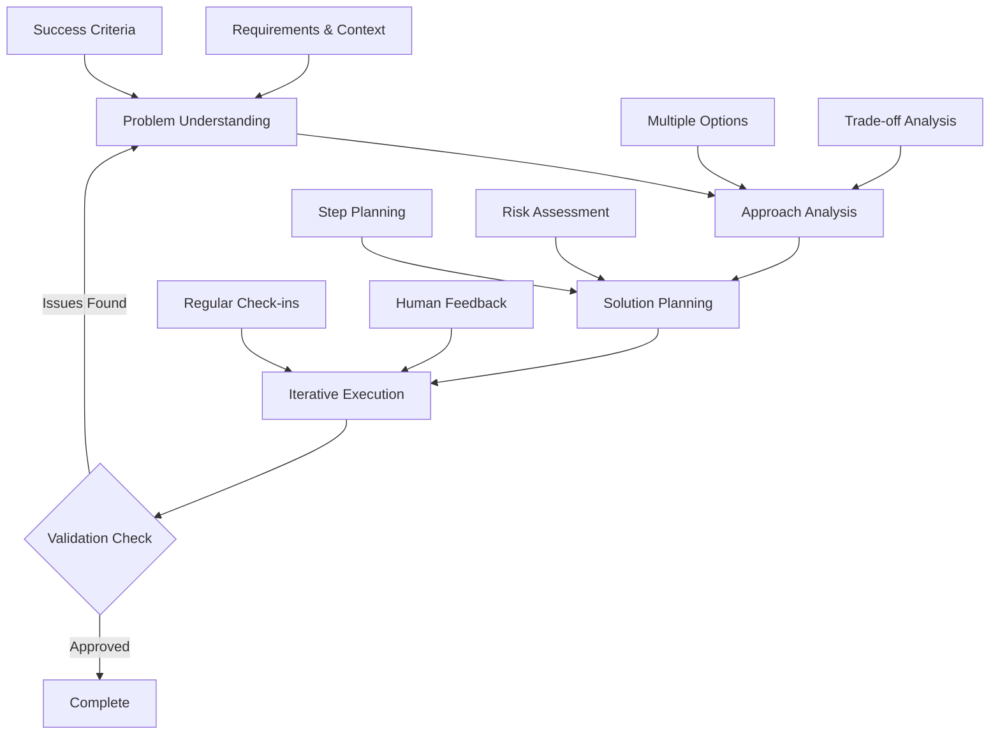

[Framework](https://github.com/Aaditri-Informatics/AI-Framework) migrated to organization

# AI (Aaditri Informatics)

## Installation

The framework uses a **prompt injection method** through the `00-rules.md` file, which contains collaboration rules that modify AI behavior:

```bash
# Place 00-rules.md in your AI assistant's rules directory:

1. For Roo Code: .roo/rules/
2. For Cline: .clinerules/
3. For Cursor: .cursor/rules/
4. For Claude: rename 00-rules.md to claude.md
```

# Human-AI Collaboration Framework

## Vision

This framework establishes a systematic approach to human-AI collaboration that prioritizes thoughtful problem-solving partnerships over simple solution generation. By implementing structured reasoning chains, clear communication patterns, and quality assurance mechanisms, it enables productive collaboration that leverages both human insight and AI capabilities.

## Core Philosophy

### Collaborative Problem-Solving
- **Human-in-the-loop**: AI operates as a thoughtful partner, not an autonomous solution generator
- **Chain-of-thought reasoning**: All complex problems are broken down into clear, reviewable steps
- **Iterative refinement**: Solutions evolve through feedback cycles and validation checkpoints
- **Context preservation**: Decisions, rationale, and learning are systematically captured

### Quality Through Process
- **Transparency**: AI shows its thinking process and confidence levels
- **Validation**: Multiple checkpoints ensure alignment and quality
- **Adaptability**: Framework adapts to different problem domains and complexity levels
- **Learning**: Both human and AI improve through documented iterations

## Architectural Principles

### 1. Structured Reasoning Chain

The framework implements a four-stage reasoning process:



### 2. Adaptive Communication Patterns

The framework provides standardized communication templates that trigger based on context:

#### Confidence-Based Triggers

Condition-driven interaction patterns based on AI confidence levels. See [00-rules.md](00-rules.md) for current trigger implementations.

#### Complexity-Based Triggers

Adaptive communication based on problem complexity assessment. See [00-rules.md](00-rules.md) for current trigger implementations.

#### Risk-Based Triggers

Escalation patterns for high-impact or ethical concerns. See [00-rules.md](00-rules.md) for current trigger implementations.

### 3. Context Management System

#### Session-Level Context
```
Problem: [brief description]
Requirements: [key requirements]
Decisions: [key decisions with rationale]
Status: [completed/remaining/blockers]
```

#### Project-Level Context

Cross-session context preservation enabling learning accumulation and decision continuity across project lifecycle.

#### Knowledge Preservation

Systematic capture and reuse of collaboration patterns, decisions, and lessons learned for continuous improvement.

### 4. Quality Assurance Framework

#### Three-Layer Validation

**Layer 1: Pre-Development**
- [ ] Requirements clearly understood
- [ ] Approach validated with human
- [ ] Potential issues identified
- [ ] Success criteria defined

**Layer 2: During Development**
- [ ] Regular check-ins with human
- [ ] Quality standards maintained
- [ ] Edge cases considered
- [ ] Limitations acknowledged

**Layer 3: Post-Development**
- [ ] Human approval received
- [ ] Solution reviewed for completeness
- [ ] Validation approach defined
- [ ] Documentation updated

## Directory Structure

The framework supports systematic organization of collaboration artifacts:

```
/
├── readme.md                    # This framework documentation
├── context/                     # Collaboration context and artifacts
│   ├── readme.md               # Context management guidelines
│   ├── docs/                   # Framework documentation
│   ├── workflows/              # Standard workflow definitions
│   ├── [project_name]/         # Project-specific collaboration context
│   │   ├── readme.md           # Project collaboration overview
│   │   ├── architecture.md     # Technical architecture decisions
│   │   └── journal/            # Session-by-session collaboration log
│   │       ├── [YYYY-MM-DD]/   # Daily collaboration sessions
│   │       │   ├── [HHMM]-[task_name].md  # Individual session records
├── [project_name]/             # Actual project files and deliverables
│   ├── readme.md               # Project documentation
│   └── (other project folders/files)  # Project-specific files and folders
```

## Framework Evolution

This collaboration framework is designed to evolve based on:
- Practical experience and usage patterns
- Effectiveness metrics and user feedback
- Domain-specific requirements and adaptations
- Technological capabilities and limitations
- Community contributions and improvements

Framework improvements and contributions should align with the core philosophy of thoughtful, collaborative problem-solving.

---

*This framework emphasizes that the goal is collaborative problem-solving, not just answer generation. Take time to understand, explain your thinking, and work together toward the best solution.*
